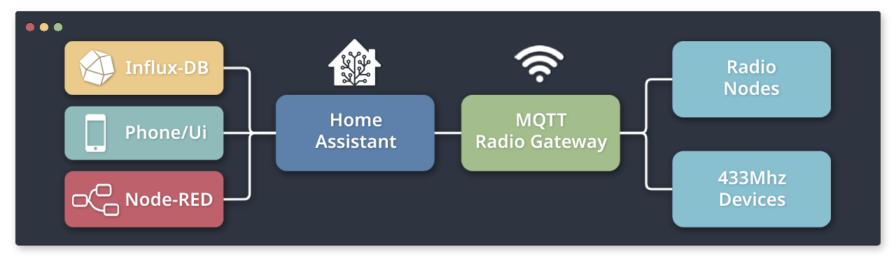
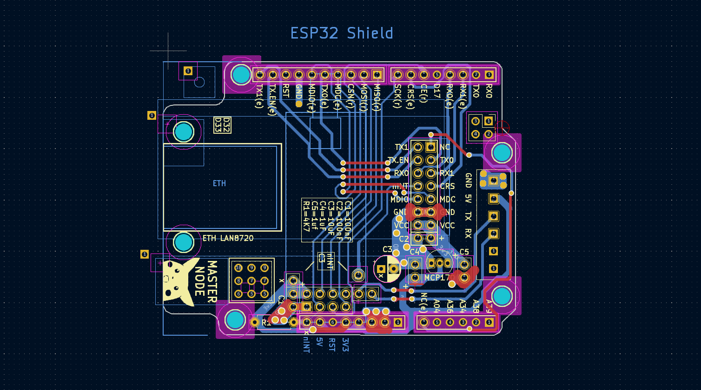

    <h1>
        MQTT Radio Gateway         
        
            
    </h1>   

A lightweight MQTT gateway for [Radio-Nodes](https://github.com/Peppson/Radio-Nodes) (or any other *NRF24L01*-based project) and generic   
433Mhz radio devices, such as power sockets, lights, sensors etc.  

Written in C++ for the ESP32 microcontroller.

&nbsp; 
## Project Overview
- Primarily made for personal "needs" and as a learning experience.   
  However if there's anything here that can benefit someone else's project,   
  feel free to use it!
- Most configuration can be found in `include/config.h`   
  Additionally, some class specific configs lives inside the `include/classes/` folder.
- The `helpers` folder includes a few .ino files for calibration/setup etc.

&nbsp; 
## Hardware - ESP32 Shield
Designed a custom PCB to fit ontop of an ESP32 (Uno) development board.   
Integrates a *LAN8720* ethernet module, a *NRF24L01* 2.4Ghz transceiver   
and some extra I/O pins in a compact format.  

Kicad files can be found here: 
[📂 .kicad - ESP32 shield](./.kicad%20-%20ESP32%20shield)  
Finished project image: 
[📷 .images/gateway.jpg](./.images/gateway.jpg)  

&nbsp;

&nbsp; 
## License 
This repository is licensed under the MIT license. See the 
[LICENSE](./LICENSE) file for more information.

&nbsp; 

